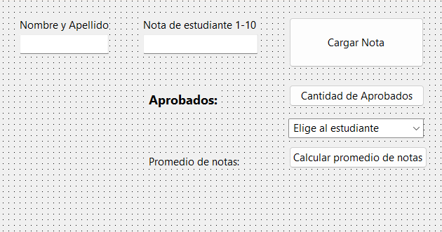

# Pascal: Sistema GUI de Gestión Escolar con Vectores Paralelos y Consultas Indexadas

Este repositorio contiene un proyecto práctico de escritorio desarrollado en **Pascal** utilizando el entorno **Lazarus / Delphi** enfocado en el manejo de colecciones estáticas estructuradas. La aplicación implementa un sistema básico de administración de calificaciones estudiantiles que enlaza dos arreglos unidimensionales paralelos ($\text{capacidad } = 5$), ejecuta rutinas de acumulación aritmética para obtener métricas escolares y resuelve búsquedas inversas asíncronas explotando las propiedades de selección de componentes interactivos visuales.

---

## 📊 Interfaz Gráfica del Sistema

Para documentar tu panel de control y sus elementos de entrada de texto, guarda la captura de pantalla de tu formulario en la raíz del repositorio con el nombre exacto de `interfaz_notas.png`:



---

## ⚙️ Arquitectura de Datos y Análisis de Módulos

El código fuente en `src/Unit1.pas` destaca por la sincronización precisa de sus componentes funcionales:

### 1. Sincronización de Vectores Paralelos (`btn_cargarClick`)
La estructura utiliza dos arreglos independientes (`nombres` y `notas`) que comparten una relación lógica idéntica a través de la variable global de control de índice `i`. Al registrar un alumno, los datos se almacenan en posiciones emparejadas y el identificador textual se inyecta en el control de selección visual:
```pascal
notas[i] := nota;
nombres[i] := nombre;
combox_estu.items.add(nombres[i]); // Inyección coordinada en el ComboBox

```

### 2. Conversión Homogénea de Tipos y Promedios (`btn_promedioClick`)

El módulo ejecuta una iteración exhaustiva sobre las posiciones de los enteros para calcular el acumulado. Posteriormente, efectúa la división utilizando la constante de tamaño máximo. Al procesar el resultado sobre un tipo de dato continuo (`real`), se aplica la función del sistema `floattostr()` para normalizar y castear la variable antes de su salida en el `TLabel`:

```pascal
promedio := suma / max; // División exacta (operación de punto flotante)
lbl_promedio.caption := lbl_promedio.caption + ' ' + floattostr(promedio);

```

### 3. Ajuste de Base en Consultas Dinámicas (`combox_estuSelect`)

El procedimiento se dispara de forma automática cuando el usuario selecciona un estudiante en la lista desplegable. Como las colecciones de la interfaz gráfica se indexan en base 0 ($0 \dots \text{N}-1$) y los arreglos de datos del sistema se estructuraron en base 1 ($1 \dots 5$), el algoritmo calcula dinámicamente un ajuste lineal de desplazamiento para extraer el registro correcto:

```pascal
if combox_estu.ItemIndex <> -1 then
begin
  posicion := combox_estu.ItemIndex + 1; // Ajuste de base (0->1, 1->2, etc.)
  showmessage(nombres[posicion] + ', sacó un ' + inttostr(notas[posicion]));
end;

```

---

## 🛠️ Conceptos Técnicos Aplicados

* **Manejo de Arreglos Unidimensionales Paralelos**: Técnica de diseño de software que mantiene múltiples estructuras de datos de distinta naturaleza (strings e integers) vinculadas de manera unívoca mediante la coincidencia estricta de sus claves de índice.
* **Casteo de Datos de Precisión Flotante (`real`)**: Operaciones aritméticas y lógicas adaptadas para procesar cocientes continuos, requiriendo funciones transformadoras específicas de salida visual (`floattostr`).
* **Sincronización por Eventos Asíncronos (`OnSelect`)**: Arquitectura reactiva que intercepta las acciones del operador en la interfaz de usuario para ejecutar búsquedas de acceso directo directo en memoria RAM sin necesidad de bucles cíclicos redundantes.
